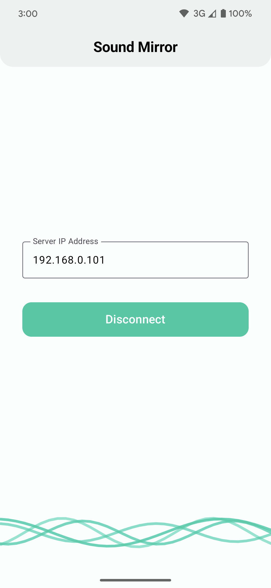
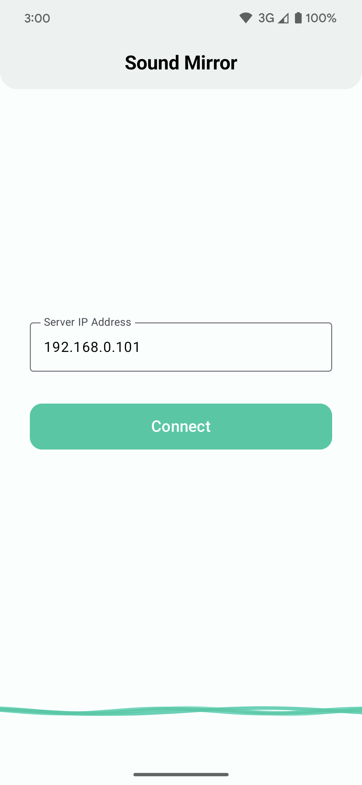

## **SoundMirror**
Audio Streaming Application.

The repository contains two primary components:
- Server: a C++ application that reads raw audio data and streams it over a local Wi-Fi network.
- Client: an Android application built with Kotlin that connects to the server, receives the audio stream, and plays it in real time.

<div style="display: flex; gap: 30px;">
  
  
</div>

### **Build Instructions**
#### Server
1. Clone the repository:

```bash
git clone https://github.com/Fetisyony/SoundMirror.git
cd SoundMirror/server
```

2. First make sure that you have Boost library installed on you device.
Now create a build directory and run CMake:

```bash
mkdir build && cd build
cmake ..
```

3. Compile:
```bash
cmake --build . --config Release
```

4. You will find the resulting executable in ```build/```.

#### Client
1. After cloning the repository in the part about server side, open the ```client/``` directory in Android Studio.

2. Sync Gradle.

3. Ensure that your device fits the requirements in ```build.gradle.kts```: Compile SDK Version and Target SDK Version.

### **Usage**
- Start the server application using CMake. Upon startup, it will display the IP address it is listening on

- Launch the Android application and grant it notification permissions

- Enter into the text field the server IP address displayed by the server upon startup

- Tap Connect

- That's it!

Note:
Once streaming, you can background the app; audio continues playing.
To return, tap on the notification, which brings your existing application instance back to the foreground.
